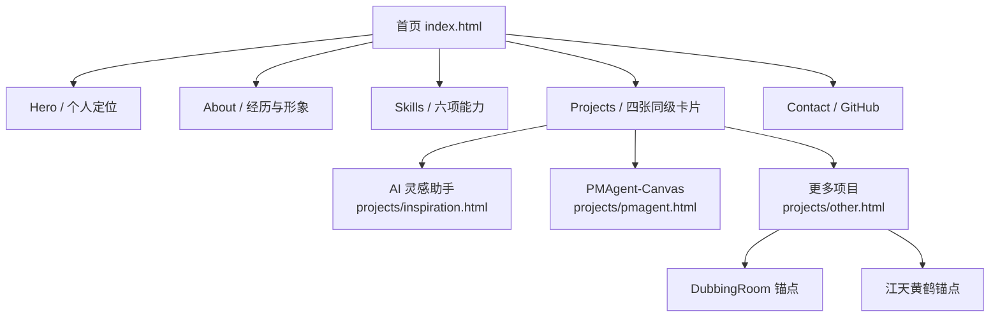

# 改版前站点评估与结构地图

记录日期：2026-09-17。本文保留改版前的静态站点基线；后续已按用户选定的纯黑实验视觉实施。当前页面结构、交互和验收说明见 [本轮实现](04-implementation.md)。

## 一句话判断

网站已经能完整展示两份主要案例，也能在桌面和手机端正常浏览；下一步需要让招聘方先看到「用户体验设计 / 产品体验设计」的职业主线，再主动展开兴趣创作。当前视觉与交互仍明显继承 Vinod 模板，缺少以个人工作方法组织内容的识别点。

## 已核实的现状

| 项目 | 当前状态 | 对后续设计的影响 |
| --- | --- | --- |
| 技术 | 原生 HTML、CSS、JavaScript；GitHub Pages 可直接从仓库根目录发布 | 可以渐进调整，不需要先迁移框架 |
| 页面 | `index.html`、`projects/inspiration.html`、`projects/pmagent.html`、`projects/other.html` | 三个项目详情路径应保持可访问 |
| 首页 | Hero → About → Skills → Projects → Contact | 职业案例出现较晚；四张项目卡片权重相同 |
| 案例 | AI 灵感助手 21 张板面、PMAgent-Canvas 22 张板面；更多项目 1 张总览 | 深度足够，但长页面缺少章节导航与先读摘要 |
| 资源 | 第 04–47 页共 44 张 WebP 板面，约 7.1 MB；首页另有两张封面和形象照 | 保留懒加载与原尺寸查看，避免首页加载所有板面 |
| 浏览器 | 1440px 与 390px 视口下无横向溢出；检查时无页面脚本异常 | 当前响应式结构可作为迭代基线 |
| 发布 | 公开仓库 `main` 已有站点文件；GitHub Pages 发布来源是否启用仍待最终确认 | 上线验证与设计迭代分开记录 |

评估方式：阅读四个 HTML 页面及 `style.css`/`custom.css`，用 CodeGraph 检查 `main.js`，用本地 Edge/Playwright 查看桌面和 390px 手机视口。此检查不等同于完整可访问性审计或真实用户测试。

## 当前信息架构

| 入口 | 已有内容 | 当前问题 |
| --- | --- | --- |
| 首页 Hero | 姓名、`UX × AI Design`、简短自述 | AI 风格明确，但「UX 设计 / 产品方向」的求职定位与证据没有同时出现 |
| About | 教育、字节跳动与实验室经历、个人形象照 | 信息可信；长段落和经历列表还可压缩成与岗位对应的能力证据 |
| Skills | 用户研究、交互、原型、Agent、前端、AIGC 影像 | 通用技能格弱化了「发现问题 → 定义方案 → 验证落地」的方法链；AIGC 影像与职业能力同级 |
| Projects | 两个完整案例、DubbingRoom、江天黄鹤 | 主案例与兴趣创作同级呈现，招聘方难以立即判断优先顺序 |
| 案例详情 | 概览文字、原版板面、外部链接 | 板面文字在手机宽度下需要点开原图；缺少章节索引、贡献/结果摘要和阅读进度 |
| 更多项目 | 第 47 页总览 + 两段简介 | 竞赛与游戏策划/开发尚无对应页面内容，现有页也不是清晰的兴趣分类入口 |
| 手机首屏 | 姓名、岗位词和主要按钮均可阅读 | 留白较多，GitHub 链接排在「浏览精选作品」之前；主要行动应更早、更醒目 |

## 模板依赖与可维护性

- `style.css` 是 Vinod 模板原始样式；`custom.css` 在其后加载，负责个人品牌、项目页和响应式覆盖。后续优先修改 `custom.css`，避免大面积重写模板规则。
- `index.html` 持有首页内容、项目卡片和站内锚点；三个 `projects/*.html` 各自包含导航、页脚、项目摘要和板面序列。重复的导航/页脚修改时要同步检查四页。
- `main.js` 管理移动菜单、主题记忆、导航激活、返回顶部、入场动画和鼠标跟随。CodeGraph 当前索引 **1 个 JavaScript 文件、14 个节点、21 条关系**；它不索引本站的 HTML/CSS，因此不能单独作为页面结构图。
- 首页有主题切换按钮，项目详情页没有；主题状态却会被 `main.js` 读入所有页面。后续需统一主题入口或明确固定项目页主题。
- 案例板面现在是打开原图新标签页的链接，并非站内弹窗。若后续改成站内放大层，需另行实现 Escape 关闭和焦点返回。
- `projects/other.html` 的两个锚点是旧链接兼容入口。将来拆分兴趣页面时，保留这些锚点或提供可用跳转。
- 已从公开版本移除个人邮箱与带提取码的网盘链接；以后新增公开联系方式、演示链接和图片前，应逐项确认可公开范围。

## 优化优先级

1. **内容层级**：先区分 UX 设计、产品体验设计、兴趣创作，并让前两类优先呈现。
2. **案例阅读**：为两份长案例增加 30 秒概览、章节入口和原尺寸板面浏览提示。
3. **个人识别**：把研究、原型与开发的工作方法变成视觉语言，而不只更换模板颜色和文案。
4. **交互与性能**：将悬浮、点击、跟随效果放在有明确用途的区域，保留键盘、触屏和减少动效模式。

下一步的分类和交互规则见 [02-experience-blueprint.md](02-experience-blueprint.md)，改动入口及检查方法见 [03-maintenance-guide.md](03-maintenance-guide.md)。
