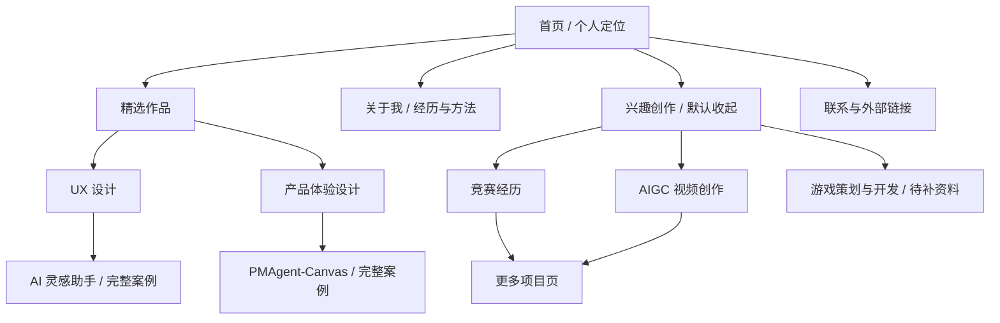

# 个性化体验方案

更新：2026-09-17。目标是把当前模板站点逐步变成以杨雯捷的经历、作品和工作方法为中心的个人网站。方案基于 [当前站点评估](01-site-audit.md)，不要求重建技术栈或改掉现有详情页地址。

实施方向已按用户后续意见修订：采用纯黑、艺术与实验感的舞台，参考抖音小游戏的首屏和滚动卡片，以个人信息与轻量循环动效替代视频。当前已实现内容见 [04-implementation.md](04-implementation.md)。下面的信息层级与案例写作原则继续适用。

## 定位与阅读顺序

首页第一屏回答三个问题：**我是谁、适合什么岗位、最值得看哪两个作品**。推荐主标题为「杨雯捷｜用户体验设计 · 产品体验设计」，副标题用一句话说明「从用户问题出发，结合研究、交互原型与 AI 工具，把体验想法推进到可验证的产品方案」。求职目标可在简介中写明 UX 设计师 / 产品经理或产品助理方向；发布前按实际投递岗位决定主次文案。

面向不同阅读时间设计三层内容：

| 阅读时间 | 访客能获得什么 | 页面承载方式 |
| --- | --- | --- |
| 30 秒 | 岗位方向、两项代表作、个人优势、联系入口 | Hero、两张主案例卡、简短能力证据 |
| 2 分钟 | 每个案例的问题、职责、方法和可证实结果 | 首页案例摘要、项目详情首屏 |
| 深入阅读 | 过程板面、取舍、方案细节、复盘 | 项目详情的章节索引与原图浏览 |

首页的主动作是「看 UX 案例」和「看产品案例」。GitHub 与其他创作可见，但不抢主动作。不要把未经核实的流量、转化率或业务结果写成案例成果。

## 建议的信息架构

### 首页顺序

1. **Hero**：姓名、职业定位、个人形象照与作品入口；两侧作品缓慢漂浮，鼠标经过时局部显影。
2. **精选作品**：UX 设计与产品体验设计各一张主卡。卡片直接给出问题、个人职责、产出物/验证证据；不要只放技术标签。
3. **我如何工作**：用「洞察问题 → 定义机会 → 原型验证 → 协同落地」代替通用技能墙。每一步关联一个已存在的作品证据。
4. **关于我**：教育、字节跳动与实验室经历；摘要围绕目标岗位，详细信息仍可展开阅读。
5. **兴趣创作**：默认只显示标题与一行说明，点击后展开竞赛、AIGC 视频、游戏策划与开发。
6. **联系**：公开的 GitHub 与经确认可公开的联系渠道。

导航仍可沿用当前五段结构与 `#home`、`#about`、`#skills`、`#projects`、`#contact` 锚点。视觉上可把 `#projects` 显示为「作品」，把 `#skills` 显示为「方法与能力」。新增兴趣区域使用 `#interests`；如果导航需要直达兴趣，点击该链接后应自动展开。原有 `projects/inspiration.html`、`projects/pmagent.html`、`projects/other.html#dubbingroom`、`projects/other.html#jiangtian` 保持可访问。

### 现有作品归类与证据

| 分类 | 作品 / 材料 | 当前可用程度 | 下一步 |
| --- | --- | --- | --- |
| UX 设计 | 字节跳动 AI 灵感助手 | 21 张过程板面，适合作为 UX 主案例 | 提炼问题、研究依据、关键方案、个人贡献与验证，板面仍保留 |
| 产品体验设计 | PMAgent-Canvas | 22 张过程板面，适合作为产品主案例 | 补清用户、场景、需求优先级、功能取舍与交付结果 |
| 产品体验设计 / 辅助 | DubbingRoom | 当前为简短简介及总览板面 | 如有需求、流程或原型证据，再决定是否升级成独立案例 |
| 兴趣 · 竞赛经历 | 设计竞赛与获奖材料 | 第 47 页含概览；原始材料中有证书 | 选择可公开的奖项、年份、个人角色与作品链接，不把奖项当作项目成果数据 |
| 兴趣 · AIGC 视频创作 | 江天黄鹤、VIVO 创意广告等 | 第 47 页有作品线索；原始文件夹有视频 | 挑选 1–3 个代表作，补创意意图、制作过程、可公开播放链接 |
| 兴趣 · 游戏策划与开发 | 尚未在当前站点及已检索文件名中确认对应材料 | 暂无可发布项目 | 保留分类规划；拿到策划案、原型、截图或演示后再上架，不制作空案例 |

竞赛和视频可能指向同一作品。兴趣面板可从两个角度介绍，但只维护一份详情，避免重复卡片和不一致文案。

## 页面与案例的内容模板

两份主案例的首屏增加精简摘要，让面试官在阅读长板面前理解项目：

| 字段 | 写作要求 |
| --- | --- |
| 项目背景 | 谁遇到什么问题，为什么值得解决 |
| 我的角色 | 负责的研究、定义、原型、协作或验证环节；多人项目明确边界 |
| 核心动作 | 2–3 个最能体现判断力的决策，附依据 |
| 方案与结果 | 交付了什么、如何验证；只有已确认的数据才写数字 |
| 复盘 | 一项做得好的判断、一项待改善的取舍 |

AI 灵感助手可强调用户研究、交互路径与体验验证；PMAgent-Canvas 可强调需求定义、优先级、产品流程与跨职能交付。正文仍由原有板面承载；在板面前放章节入口（背景、洞察、方案、验证、复盘），避免让读者从第 1 张一路猜到第 21/22 张。手机端注明「点击板面查看原图」并提供方便的返回入口。

## 视觉识别方向

采用用户选定的纯黑实验视觉：中心是个人信息，周围是低亮度的真实作品画面。鼠标经过时，柔和遮罩显露底层图片与蓝粉色光感；移开后回到暗处。触屏用轻触探索，主要文字与入口始终可见。

项目区用大幅卡片与连续滚动渐入承接首屏。UX 卡片偏暖粉、产品卡片偏冷蓝，类别同时用文字标注。取消设计研究笔记式的网格背景与批注语言。个人形象照保留原貌，首屏圆形展示，About 中保留完整方形画面。浅色模式只调整内容阅读区域，首屏继续使用黑色舞台。

## 交互设计：每个效果有明确任务

| 位置与触发 | 体验方案 | 作用 | 键盘 / 触屏 / 减少动效 |
| --- | --- | --- | --- |
| 主案例卡悬浮 | 柔和聚光跟随指针，卡片边界和「查看案例」同时响应 | 提示可点击区域、强化精选层级 | 焦点态有固定高亮；触屏使用静态高亮；减少动效时无跟随 |
| Hero 主 CTA 悬浮 | 小幅磁吸，位移限制在按钮附近 | 引导进入主案例，不影响读取 | 焦点态保持原位；触屏与减少动效关闭位移 |
| 兴趣标题点击 | 原生 `

` 或等价按钮控制的展开面板 | 让职业内容先读，兴趣按需展开 | 支持 Enter/Space、`aria-expanded`、深链自动展开；绝不只靠悬浮触发 |
| 案例板面点击 | 沿用现有原图新标签页，增加可发现的放大提示；若改为站内放大层，再实现缩放与关闭 | 解决移动端小字阅读 | 链接可用键盘打开；若使用放大层，支持 Escape 关闭并将焦点返回原板面 |
| 案例滚动 | 轻量章节导航与当前章节标记 | 告知阅读进度，便于跳读 | 锚点可直接访问，禁用动画仍可跳转 |
| 鼠标跟随 | 只在案例卡区域把现有自定义光标换成「查看案例」状态 | 明确下一步动作 | 触屏不显示；不可遮挡文字和真实焦点 |

优先级：先做**内容和兴趣展开**，再做**案例阅读**，最后加入**局部悬浮效果**。每完成一项都检查 390px 手机视口、键盘 Tab 顺序和 `prefers-reduced-motion`。避免全局点击火花、长尾随粒子、自动播放大视频，这些效果会与长案例阅读竞争注意力。

### React Bits 的适用范围

用户提供的 [React Bits](https://github.com/DavidHDev/react-bits) 是 React 组件库，而本站目前是原生 HTML/CSS/JS。其 [SpotlightCard](https://github.com/DavidHDev/react-bits/blob/main/src/content/Components/SpotlightCard/SpotlightCard.jsx) 和 [Magnet](https://github.com/DavidHDev/react-bits/blob/main/src/content/Animations/Magnet/Magnet.jsx) 思路可用少量原生代码实现；[TiltedCard](https://github.com/DavidHDev/react-bits/blob/main/src/content/Components/TiltedCard/TiltedCard.jsx) 与 [Dock](https://github.com/DavidHDev/react-bits/blob/main/src/content/Components/Dock/Dock.jsx) 依赖 `motion/react`，为它们迁移整站或增加 React 构建链不合算。若以后直接复制 React Bits 代码，先核对其 [MIT + Commons Clause 许可](https://github.com/DavidHDev/react-bits/blob/main/LICENSE.md)，保留要求的许可声明；当前方案仅参考交互模式。

交互的可访问性基线参照 [W3C Disclosure 模式](https://www.w3.org/WAI/ARIA/apg/patterns/disclosure/)。滚动和悬浮动画尽量只改变 `transform` 与 `opacity`，参照 [web.dev 动画性能指南](https://web.dev/articles/animations-guide)；不要每帧改布局属性。

## 同类网站的启发与边界

| 参考 | 可借鉴的判断 | 在本站的应用 |
| --- | --- | --- |
| [Brittany Chiang](https://brittanychiang.com/) | 首页尽快交代身份与精选工作，其他项目作为后续浏览 | 主案例先于兴趣，缩短招聘方找证据的路径 |
| [Bruno Simon](https://bruno-simon.com/) / [HTML 版](https://bruno-simon.com/html/) | 趣味体验可以建立记忆点，同时提供直接阅读内容的路径 | 游戏类创作放在兴趣内，未来可做单独可玩模块，不阻断主作品阅读 |
| [Robby Leonardi](https://rleonardi.com/) | 互动本身可成为作品表达 | 只有能体现个人设计判断的互动才加入首页，优先让案例内容清楚 |

以上是从这些网站呈现方式推导出的设计启发，不是对其效果或招聘转化的量化结论。

## 分阶段执行与验收

| 阶段 | 最小改动范围 | 完成标准 |
| --- | --- | --- |
| 0 · 内容校准 | 确定两份主案例摘要、个人职责与可公开证据；整理兴趣素材 | 所有对外描述可溯源，游戏类不出现空案例 |
| 1 · 首页架构 | 调整 `index.html` 与 `custom.css`，加入默认收起的兴趣区 | 30 秒内可识别求职方向与两份主案例；旧锚点可访问 |
| 2 · 案例阅读 | 改两份详情页的摘要、目录、板面导航 | 桌面与手机都能按章节进入内容，原图仍可查看 |
| 3 · 个性交互 | 局部 Spotlight、CTA Magnet、卡片光标提示 | 鼠标、键盘、触屏及减少动效模式都可完成同一任务 |
| 4 · 发布验证 | 浏览器检查、链接检查、再部署至 GitHub Pages | 所有旧路径与图片可访问，公开站点和本地一致 |

实施细节、文件入口与检查清单见 [维护指南](03-maintenance-guide.md)。
