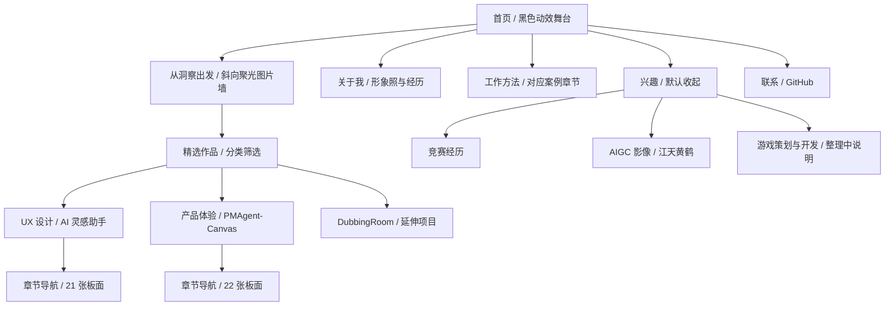

# 纯黑实验视觉：实现与验收

日期：2026-09-17。初版分支：`feat/personal-portfolio-experience`；斜向图片墙迭代分支：`feat/diagonal-work-gallery`；分类排布修正分支：`fix/ordered-gallery-rows`。实现均位于当前工作目录；线上发布状态独立于本地分支。

## 当前结构

职业案例优先；兴趣通过原生 `details` 展开。游戏类目前只有真实的分类意向和整理状态，没有虚构案例或无效按钮。DubbingRoom、江天黄鹤及 44 张板面的原有路径均保留。

## 交互与维护入口

| 效果 | 实现方式 | 维护入口 |
| --- | --- | --- |
| 首屏循环动效 | 四张作品画面缓慢漂浮；形象照周围的细环轻缓转动 | `custom.css` 的 hero 段；`index.html` 的 `.hero-gallery` |
| 鼠标显影 | 暗图层上叠一层同源图像，通过径向透明遮罩局部点亮 | `.hero-lit`、`--spot-x/y`；默认显影半径 350px |
| 触屏探索 | 轻触或滑动时更新局部光点；不阻止页面滚动 | `main.js` 的 pointer 事件 |
| 动效暂停 | 用户可暂停；首屏离开视口/页面进入后台时也暂停循环 | `motion-toggle`、`ambient-paused`、`page-idle` |
| 卡片渐入 | 原生滚动进度驱动透明度、轻微上移与缩放；首次完整出现后保持可读 | `[data-scroll-reveal]`；位移 65px、约 1/3 视口渐入 |
| 分类筛选 | 全部 / UX / 产品；保持真实链接和屏幕阅读器状态 | `data-filter`、`data-category`、`aria-pressed` |
| 局部悬浮 | 图片聚光、轻微抬升、局部「查看案例」提示；主 CTA 小幅磁吸 | `[data-spotlight]`、`[data-magnetic]` |
| 兴趣展开 | 点击、Enter 或 Space；导航与直接访问 `#interests` 会展开 | `#interest-disclosure` |
| 案例阅读 | 吸顶章节目录、阅读进度、原生 dialog 图片阅读器 | `.case-toc`、`.case-section[id]`、`.board-dialog` |
| 图片阅读器 | 上/下一张、原尺寸缩放、原图链接、Escape 关闭及焦点返回 | `main.js` 的 boardLinks 段 |

连续动画只在首屏和精选作品引导区生效，离开视口自动暂停。鼠标更新使用请求帧合并，未引入全局尾迹、WebGL、React 或新的运行依赖。主内容不依赖悬浮才能出现；减少动效模式关闭循环、跟随和滚动渐入。无 JavaScript 时，作品链接、原图链接、手机导航和兴趣展开仍可使用。

`style.css` 保留上游模板；新样式集中在 `custom.css`，使用明确的分段与颜色变量。导航在四页同步，手机按钮使用 `#menu-toggle`，避免原模板 `#hamburger` 的高优先级规则冲突。详情页新增章节锚点，不改变旧板面锚点。

## 斜向图片墙迭代

用户指定仅调整「从洞察出发。让体验发生。」引导区，首屏保留。已比较首屏 HTML 与上一提交，内容完全一致；首屏样式及交互段没有修改。

| 入口 | 维护方式 |
| --- | --- |
| `index.html` 的 `.work-discovery` | 独立全宽容器；仅裁切超出舞台边界的轨道，不在整个作品 section 上设 overflow，保持下方分类栏吸顶 |
| `#discovery-tiles` | 由素材脚本生成的分类图片清单，存于 template；不手动复制轨道 |
| `assets/images/discovery/` | 25 张 WebP：11 张 UX、14 张证书；合计约 573 KiB |
| [素材来源清单](discovery-assets.json) | 记录目标路径、原始文件相对仓库根目录路径及尺寸；更换素材时同步更新 |
| `main.js` 的 discovery 段 | 距离视口 300px 时生成 9 条轨道，固定按 UX → UX → 获奖证书重复三轮；每排仅使用本类别完整序列，无随机混排，两个相同图组保证循环接缝一致 |
| `custom.css` 的 discovery 段 | 旋转 −14°；默认周期 85 秒，交错轨道 100/115 秒；卡片尺寸随视口调整 |
| `--spot-radius` | 桌面 340px、手机 230px；中心透明，外围黑色约 96% 遮罩；图片墙默认亮度 12%，探索时恢复完整亮度 |
| `#gallery-motion-toggle` | 独立暂停/继续按钮；不联动首屏按钮；离屏或后台自动暂停；系统减少动效时不滚动、不跟随 |

图片规格规则已写入 JS、CSS 和素材生成脚本注释：所有图片等高、宽度按原图比例展开，统一 `object-fit: contain`；横向长图完整横向展示，竖图保留方向，禁止旋转、拉伸或强塞统一竖框裁切。未导入原始视频或新增前端依赖。背景仅作装饰，使用 `aria-hidden`；可阅读的案例仍由下方真实项目入口提供。手机支持轻触点亮和指针事件跟随，不拦截原生页面滚动。

更新素材：把原图放入本地 `页面图片/UX界面`、`页面图片/获奖证书`，运行 `python scripts/build_discovery_assets.py`。脚本按文件名自然排序，等比例压缩并同步 template 的分类与宽高，更新来源清单，清理清单中已不再使用的生成缩略图。原始素材目录保持本地，部署仅需生成的 WebP。

新增验收：分类行序、每排类别一致及每张图片的显示比例检查通过。五种视口均无横向溢出、图片失败或控制台错误；暂停/继续、离屏暂停、触屏点亮、减少动效和分类吸顶通过。冻结同一帧后，鼠标附近 80×80 区域平均灰度由 0.83 升至 200.32（0–255，单次本机截图测量），确认存在实际明暗差；循环接缝前后截图平均通道差小于 1。三份案例阅读器、分类筛选、兴趣展开与无 JS 浏览回归通过。新增截图见 `.local/acceptance/gallery-*.png`，完整报告见 `.local/acceptance/report.json`。

## 参考与实现边界

- [抖音小游戏](https://game.open-douyin.com/)：实际浏览首屏及下滑过程，参考黑色空间、暗处画面、集中信息与逐渐出现的卡片节奏。使用本人的形象照和项目图片，以 CSS 动效替代视频；没有复制该站素材或商业数据。
- [React Bits](https://www.reactbits.dev/get-started/index)：参考 Spotlight、Magnet 等局部交互模式；本站为原生实现，没有导入该库或复制其组件代码。
- [W3C Disclosure](https://www.w3.org/WAI/ARIA/apg/patterns/disclosure/) 与 [web.dev 动画指南](https://web.dev/articles/animations-guide)：用于展开操作、键盘与动画性能的基线。

## 验收方法

运行 `python scripts/verify_portfolio.py`。五组首页视口为 360×740、390×844、768×1024、1440×900、1920×1080；三个详情页另测 390 与 1440 宽度。脚本检查网页错误、失败请求、横向溢出、分类筛选、键盘与触屏、图片切换及缩放、焦点返回、主题记忆、减少动效切换和无 JS 使用。

本轮结果：全部检查通过。五组首页视口无横向溢出、页面错误或失败请求；三个详情页在两种宽度下的章节跳转与阅读器通过，板面数分别为 21 / 22 / 1。已人工查看桌面、平板、手机、显影状态、兴趣展开、浅色主题和图片阅读器截图，并修复旧模板菜单 ID 的尺寸冲突与章节跳转的偏移问题。静态链接、锚点、JavaScript 语法、Markdown 链接及 Git 空白检查通过。

截图与 JSON 报告保存在 `.local/acceptance/`，只用于本地验收。浏览器测量来自本机 Edge/Chromium，不能替代真实设备 Safari、Firefox 或线上网络环境的性能测试。新增文件后继续运行链接检查；更换板面数量时同步更新验收预期。

## UX 优先调整

根据最新要求，背景不再使用插画与 AIGC 素材。9 排固定为 6 排 UX、3 排证书，相邻 UX 行按固定半组偏移展示不同界面；移除不再使用的 8 张生成缩略图，用户原始素材保留。素材生成脚本仅读取 UX 和获奖证书目录，避免重新生成时把插画加回。

本次定向验收覆盖 1440px 与 390px：行序、无插画素材、完整长宽比、加载、暂停、鼠标/触屏显影及无横向溢出通过。截图位于 `.local/ordered-gallery/ux-focused-*.png`；上文五种宽度及案例阅读器报告属于前一轮完整验收。
